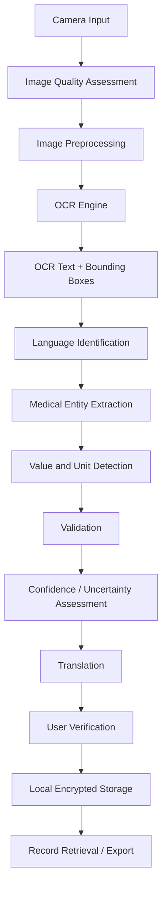
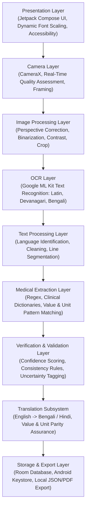
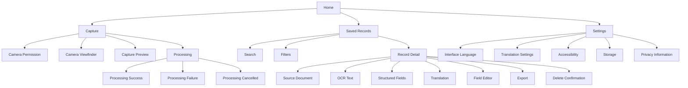
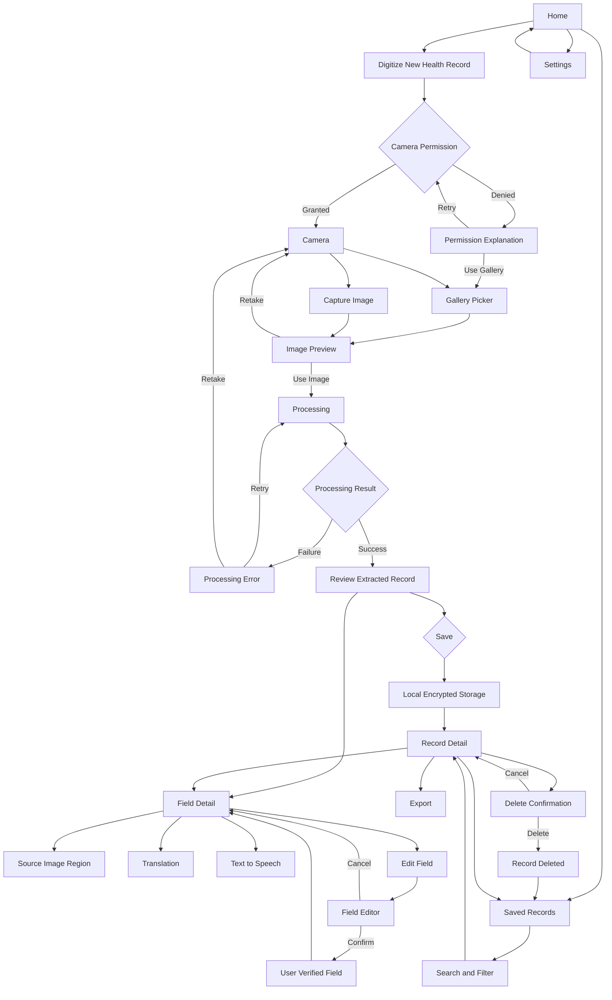

# ChikitsaLipi: Android Application for OCR-Based Digitization, Structured Extraction, and Multilingual Translation of Printed and Handwritten Health Records

## Summary

**ChikitsaLipi** is an open-source, research-oriented Android application designed for optical character recognition (OCR), structured information extraction, multilingual translation, and local digital preservation of physical health records. Targeted primarily at resource-constrained, rural, low-connectivity, and multilingual environments, ChikitsaLipi enables users to convert physical medical artifacts—including printed prescriptions, laboratory reports, clinical progress notes, diagnostic reports, referral documents, and handwritten medical records—into structured, machine-readable, and locally saved digital records.

The central design philosophy prioritizes human-in-the-loop verification, transparent uncertainty presentation, WCAG 2.2 AA accessibility, minimal cognitive load, and strict data privacy through local-first on-device processing.

---

## Technical Details

### Key Capabilities

- **On-Device Image Acquisition & Quality Assessment**: Real-time camera capture using CameraX with automated edge/document boundary detection and real-time visual assessment of ambient illumination, motion blur, and framing.
- **Image Preprocessing Subsystem**: Automated contrast normalization, grayscale conversion, perspective correction, rotation alignment, and adaptive binarization to enhance OCR accuracy across heterogenous physical document types.
- **Hybrid OCR & Text Recognition Engine**: On-device text recognition optimized for printed Latin script, Devanagari script, and Bengali script, supplemented by specialized handwriting handling models.
- **Deterministic Medical Field Extraction**: Regex-based pattern matching, clinical dictionary lookups, and context-window extraction for vital signs, laboratory parameters, numeric values, and clinical units.
- **Multilingual Translation Subsystem**: Structured field-level translation into Bengali (BN) and Hindi (HI) while strictly maintaining numeric, unit, and structural parity across target languages.
- **Human-in-the-Loop Verification Interface**: Dual-pane visual interface correlating source image regions (bounding boxes) with extracted text, uncertainty indicators, and specialized keypad editors for manual user correction.
- **Local Encrypted Storage & Traceability**: Room database persistence backed by Android Keystore, preserving original OCR outputs, user modifications, and generated translations with complete audit traceability.

---

## System Architecture

The application is built following Clean Architecture and MVVM (Model-View-ViewModel) design principles, enforcing strict separation of concerns across functional layers aligned directly with the system flowchart:





### Detailed Flowchart

```mermaid
flowchart TD
    A[Start] --> B[Home Screen]
    B --> C{User Action}
    C -->|Digitize New Record| D[Camera Interface]
    C -->|View Saved Records| Z[Saved Records Directory]

    D --> E{Camera Permission Granted?}
    E -- No --> F[Request Camera Permission]
    F --> E
    E -- Yes --> G[Live Camera Preview]

    G --> H[Image Quality Assessment]
    H --> I{Quality Check Passed?}
    I -- Poor Light / Blur / Framing Issue --> J[Display Quality Warning Banner]
    J --> K{User Action}
    K -- Retake --> G
    K -- Proceed Anyway --> L[Capture Document Image]
    I -- Quality Acceptable --> L

    L --> M[Image Preprocessing Engine]
    M --> N[Contrast Enhancement & Perspective Correction]
    N --> O[On-Device OCR Engine]

    O --> P{OCR Execution Successful?}
    P -- Failure / No Text --> Q[Display OCR Failure Error]
    Q --> K
    P -- Success --> R[Raw Text & Bounding Boxes Generated]

    R --> S[Language Identification]
    S --> T[Medical Entity Extraction Engine]
    T --> U[Value & Unit Regex Pattern Detection]
    U --> V[Validation & Confidence Assessment]

    V --> W{Confidence / Completeness Assessment}
    W -- High Confidence & Complete --> X[Mark Status: High Confidence]
    W -- Missing Unit / Ambiguous Value --> Y[Mark Status: Needs Review Tagged Uncertain]

    X --> AA[Multilingual Translation Subsystem]
    Y --> AA

    AA --> AB[Translate Field Labels to Bengali & Hindi]
    AB --> AC[Results & Verification Screen]

    AC --> AD{User Verification Decision}
    AD -- User Identifies Uncertainty / Error --> AE[Manual Correction Interface Sheet]
    AE --> AF[Specialized Medical Keypad Input]
    AF --> AG[Confirm and Update Field]
    AG --> AH[Update Status: User Verified]
    AH --> AC

    AD -- User Approves Record --> AI[Save Record to Local Encrypted Storage]

    AI --> AJ[Record Detail View]
    AJ --> AK{User Management Options}
    AK -- Export Record --> AL[Export to Structured JSON / Text / PDF]
    AK -- Delete Record --> AM[Secure Local Deletion Confirmation]
    AM --> AN[Purge File & Database Entry]
    AN --> Z
    AL --> Z

    Z --> AO[End]
```



---

## UI/UX Architecture

### Design Philosophy

The user interface of ChikitsaLipi is optimized for high legibility, low cognitive load, and ease of use by individuals with varied digital literacy levels in rural or low-resource settings.

1. **Low Cognitive Load**: Minimizes complex multi-level menus, modal distractions, and unnecessary visual ornamentation.
2. **Large Touch Targets**: Primary call-to-action touch areas maintain a minimum height and width of 56dp to 72dp.
3. **Transparent Uncertainty**: The application explicitly highlights extracted fields that have low confidence or missing units rather than hiding potential system errors.
4. **Data Separation**: Clean visual boundaries separate original source text, extracted structured entities, and regional translations.
5. **Dynamic Font & Locale Adaptation**: Supports fluid layout expansion for regional scripts (Bengali and Devanagari) without layout clipping.

### Color Palette Specification

| Purpose | Color Description | Hex Code | Semantic Meaning |
| :--- | :--- | :--- | :--- |
| Primary Surface | Warm Off-White | `#F8F9FA` | Neutral background minimizing visual fatigue |
| Primary Accent | Forest Teal | `#0F5257` | Primary actions, app header, navigation items |
| Secondary Accent | Sage Slate | `#4A7C59` | Secondary buttons, card borders, supporting metadata |
| High Confidence | Emerald | `#059669` | Automated consistency checks passed |
| Uncertainty | Amber | `#D97706` | Field missing unit, low OCR confidence, needs review |
| Critical Warning | Crimson | `#DC2626` | Processing failure, deletion alerts, system errors |

To support users with color vision deficiencies, system state is never communicated solely through color. Every state indicator incorporates text labels, semantic icons, and accessibility content descriptions.

### Typography Hierarchy

| Component | Font Size (sp) | Weight / Style | Primary Application |
| :--- | :--- | :--- | :--- |
| Application Title | 24sp | Bold | Home screen header |
| Screen Title | 24sp | Semi-Bold | Screen headers |
| Section Heading | 18sp | Medium | Card section dividers |
| Body Text | 18sp | Regular | Descriptive text, instructions |
| Medical Values | 18sp | Bold / Monospace | Extracted lab values, vitals |
| Supporting Text | 16sp (min) | Regular | Captions, status metadata |
| Buttons | 16sp - 18sp | Medium / Bold | Touch targets, actions |

Recommended typography engines: Google Sans or Inter for Latin script; Noto Sans Bengali for Bengali script; Noto Sans Devanagari for Hindi script.

---

## Complete Interaction and Navigation Model

Design ChikitsaLipi around a predictable, shallow, state-driven navigation model.

The navigation system ensures that users can always understand:
1. Where they are
2. What the application is doing
3. What information has been extracted
4. What requires verification
5. What action is available next
6. What will happen if they press Back
7. Whether information has been saved
8. Whether an operation can be cancelled safely

The application avoids hidden navigation, ambiguous gestures, irreversible actions without confirmation, and navigation states that can cause accidental loss of captured health information.

### Navigation Architecture

Use a single primary application navigation graph:



Primary user journey:
**Home → Capture → Preview → Processing → Review → Verify → Save → Record Detail**

Secondary user journey:
**Home → Saved Records → Record Detail → Review/Edit/Export/Delete**

### Navigation Principles

1. Home is the root destination.
2. Every major screen provides an obvious way to return to the previous state.
3. The Android system Back action behaves consistently with the visible navigation hierarchy.
4. Back navigation never silently discards unsaved medical information.
5. Destructive operations require explicit confirmation.
6. Processing operations are cancellable where technically safe.
7. Navigation does not restart OCR unnecessarily.
8. Previously completed processing stages are not repeated unless the user explicitly requests reprocessing.
9. Temporary state is preserved during ordinary configuration changes such as screen rotation.
10. Navigation state survives temporary backgrounding where technically feasible.
11. The application distinguishes temporary processing state from permanently saved records.
12. A user can never mistake a draft record for a saved record.

### Navigation State Model

Explicit application states:

`IDLE` → `CAPTURE_READY` → `CAPTURED` → `IMAGE_REVIEW` → `PROCESSING` → `OCR_COMPLETE` → `EXTRACTION_COMPLETE` → `TRANSLATION_COMPLETE` → `REVIEW_REQUIRED` → `EDITING_FIELD` → `USER_VERIFIED` → `READY_TO_SAVE` → `SAVED` → `EXPORTING` → `DELETE_CONFIRMATION` → `DELETED`

Transition diagram:

```text
IDLE → CAPTURE_READY → CAPTURED → IMAGE_REVIEW → PROCESSING → OCR_COMPLETE → EXTRACTION_COMPLETE → TRANSLATION_COMPLETE → REVIEW_REQUIRED → USER_VERIFIED → READY_TO_SAVE → SAVED
```

Failure states return the user to an actionable state rather than creating a dead end.

### Navigation Graph (Mermaid Diagram)



### Interaction State Matrix

| Current State | User Action | Next State | Data Preserved | Confirmation Required |
| :--- | :--- | :--- | :--- | :--- |
| Home | Digitize | Camera | No record data | No |
| Camera | Capture | Preview | Temporary image | No |
| Preview | Retake | Camera | Previous image discarded | No |
| Preview | Use Image | Processing | Temporary image | No |
| Processing | Cancel | Home/Camera | Temporary state cleaned | Conditional |
| Processing | Success | Review | Extracted data | No |
| Review | Edit | Field Editor | Original OCR preserved | No |
| Field Editor | Confirm | Review | Correction stored | No |
| Review | Save | Record Detail | Full record persisted | Optional |
| Review | Back | Previous state | Unsaved state preserved | Conditional |
| Record Detail | Export | Export | Record preserved | Yes |
| Record Detail | Delete | Confirmation | Record preserved until confirmation | Yes |
| Delete Confirmation | Delete | Saved Records | Record removed | Yes |

### Interaction Design for Medical Uncertainty, Numeric Values, and Handwriting

- **Medical Uncertainty**: Uncertainty is treated as a first-class interaction state. Low-confidence fields are explicitly tagged (`Needs Review`, `Unit not detected`) with dynamic links allowing users to view source image bounding box regions before editing or verifying.
- **Numeric Medical Values**: Numerical values retain original decimals, slashes, and units without automatic rounding or truncation. Medical keypads strictly present digits 0-9, decimal (`.`), and slash (`/`).
- **Handwritten Records**: Handwritten documents trigger a clear non-blocking advisory encouraging explicit visual side-by-side comparison with the original document snippet.
- **Accessibility & Privacy**: Full TalkBack content descriptions for screen elements, minimum touch target size (56dp to 72dp), dynamic font scaling support, and total suppression of sensitive health data from system notifications or recent application previews.

---

## Screen-by-Screen Specification

### 1. Home Screen
- **Header**: Displays "ChikitsaLipi", subtitle "Digital Health Record", a tri-language toggle (`English | বাংলা | हिन्दी`), and a total saved record counter (e.g., "12 saved records").
- **Primary Action Card**: Dominant hero card labeled "DIGITIZE NEW HEALTH RECORD" with caption "Photograph a prescription, laboratory report, or clinical note." Triggers Camera Capture Interface.
- **Secondary Action Card**: Labeled "SAVED RECORDS" with caption "View, search, verify, and manage digitized records." Triggers Saved Records Directory.
- **Privacy Notice**: Minimal footer stating: "Your records are processed locally on device and remain under your complete control."

### 2. Camera Capture Interface
- **Viewfinder**: Full-screen live camera preview with dynamic overlay framing guidelines.
- **Real-Time Quality Assessment Banner**: Non-intrusive status top banner displaying:
  - *Good Quality*: "Lighting and focus acceptable"
  - *Low Light*: "Low light detected. Consider using flash or moving to a brighter location."
  - *Blur*: "Image appears blurred. Hold the camera steady."
  - *Document Not Detected*: "Position the complete document inside the frame."
- **Camera Controls**: Bottom bar featuring Flash Toggle (Auto / On / Off), 72dp Shutter Button, and Gallery Import Button.
- **Capture Review**: Post-capture modal offering direct inspection, "Retake", or "Use Image".

### 3. Processing Interface
- **Status Display**: Real-time progress tracker with explicit stage states (`Completed`, `In Progress`, `Pending`, `Failed`).
- **Pipeline Stages**:
  1. Image Quality Assessment
  2. Image Preprocessing
  3. On-Device OCR
  4. Medical Field Extraction
  5. Multilingual Translation
  6. Preparing Verification
- **Cancellation**: "Cancel Processing" button safely aborts operations without saving unverified temporary files.

### 4. Results and Verification Screen
- **Header**: "Review Extracted Record" with back navigation.
- **Dual-Pane View**:
  - *Source Document Pane*: Interactive view with pinch-to-zoom, pan, full-screen viewing, and dynamic bounding box highlight corresponding to selected extracted fields.
  - *Structured Field Cards*: Display category, field name, value, unit, status tag, and regional translations (Bengali/Hindi).
- **Audio Output**: Dedicated "Listen" button triggering Text-to-Speech narration of translated values in the selected language.

### 5. Manual Correction Interface (Bottom Sheet / Full Screen Editor)
- **Source Crop**: Displays zoomed image region corresponding to the targeted field.
- **Field Name & Value Inputs**: Editable text field for name; numeric field backed by a custom medical keypad.
- **Custom Keypad**: Features digits 0–9, decimal point (`.`), slash (`/`), backspace, and clear.
- **Unit Selector**: Chip selection for standard medical units (`g/dL`, `mmHg`, `mg/dL`, `bpm`, `%`, `°C`, `kg`, `cm`, `mL`, `Custom`).
- **Confirmation Action**: Updates status to **User Verified**.

### 6. Saved Records Directory & Record Detail
- **Directory**: Includes search by date, field name, record type, or clinic name; filter chips (`All`, `Vitals`, `Laboratory`, `Prescriptions`, `Other`); and summary cards displaying record metadata.
- **Record Detail**: Full audit view preserving original captured image, raw OCR text, extracted structured fields, user corrections, timestamp, and translations.
- **Export & Delete**: Export options (JSON, Plain Text, PDF) with explicit user confirmation; secure deletion prompt requiring two-step confirmation.

---

## Primary and Secondary Objectives

### Primary Objectives
1. Develop an accessible Android application for digitizing physical health records in low-resource settings.
2. Extract text accurately from photographed printed and handwritten clinical artifacts using on-device OCR.
3. Automatically identify and structure common clinical parameters (vitals, lab results, units).
4. Translate extracted structured text into Bengali and Hindi while ensuring numerical and unit invariance.
5. Provide a dual-pane verification interface allowing users to cross-examine OCR outputs against original document regions.
6. Enable secure, encrypted, on-device storage without requiring continuous cloud connectivity.

### Secondary Objectives
1. Quantify OCR Character Error Rate (CER) and Word Error Rate (WER) across document types.
2. Evaluate medical field, value, and unit extraction accuracy.
3. Characterize pipeline execution speed and latency across varied Android hardware specifications.
4. Evaluate quality and adequacy of Bengali and Hindi translations.
5. Compare performance metrics between printed text and handwritten records.

---

## Primary Endpoints

The system performance is evaluated using the following mathematical formulas:

### 1. Character Error Rate (CER)
Measures string distance at character level between OCR output and ground truth.

$$CER = \frac{S_c + D_c + I_c}{N_c}$$

Where:
- $S_c$ = Number of character substitutions
- $D_c$ = Number of character deletions
- $I_c$ = Number of character insertions
- $N_c$ = Total number of characters in ground truth reference

### 2. Word Error Rate (WER)
Measures distance at word level.

$$WER = \frac{S_w + D_w + I_w}{N_w}$$

Where:
- $S_w$ = Number of word substitutions
- $D_w$ = Number of word deletions
- $I_w$ = Number of word insertions
- $N_w$ = Total number of words in ground truth reference

### 3. Medical Field Extraction Accuracy ($A_{field}$)

$$A_{field} = \frac{C_{field}}{T_{field}} \times 100\%$$

Where $C_{field}$ is the count of correctly identified medical field names and $T_{field}$ is the total number of ground truth medical fields.

### 4. Numerical Value Extraction Accuracy ($A_{value}$)

$$A_{value} = \frac{C_{value}}{T_{value}} \times 100\%$$

Where $C_{value}$ is the count of correctly extracted numeric values matching ground truth exactly.

### 5. Unit Recognition Accuracy ($A_{unit}$)

$$A_{unit} = \frac{C_{unit}}{T_{unit}} \times 100\%$$

Where $C_{unit}$ is the count of correctly recognized and normalized medical measurement units.

### 6. Successful Document Processing Rate ($R_{proc}$)

$$R_{proc} = \frac{N_{successful}}{N_{total\_attempts}} \times 100\%$$

Where $N_{successful}$ represents documents processed through the full pipeline without fatal unhandled exceptions.

---

## Secondary Endpoints

- **Translation Quality Score**: Human-evaluated adequacy and fluency score on a 1–5 Likert scale for Bengali and Hindi renderings.
- **Pipeline Execution Latency**: Time measured in milliseconds from image capture to results display.
- **User Correction Rate**: Proportion of extracted fields modified by human operators during verification.
- **Image Quality Failure Rate**: Percentage of captures flagged as unusable due to severe blur, extreme low light, or severe skew.
- **Printed vs. Handwritten Accuracy Delta**: Comparative CER/WER performance gap between printed records and cursive handwritten notes.
- **System Resource Footprint**: Average CPU utilization, peak RAM consumption (MB), and storage footprint per record.

---

## Evaluation Framework

The evaluation methodology uses a structured testing benchmark:

1. **Dataset Construction**: A standardized benchmark set comprising 300 physical medical documents divided equally into:
   - Printed Laboratory Reports ($n = 100$)
   - Printed Prescriptions ($n = 100$)
   - Handwritten Clinical Notes ($n = 100$)
2. **Environmental Conditions**: Controlled testing under varied illumination levels (100 lux, 300 lux, 800 lux), intentional camera tilt angles ($0^\circ, 15^\circ, 30^\circ$), and simulated motion blur.
3. **Hardware Heterogeneity**: Evaluated across three device tiers: Entry-level (2GB RAM), Mid-range (4GB RAM), and Flagship (8GB+ RAM).
4. **Ground Truth Annotation**: Dual independent expert human annotation of all text tokens, medical entities, values, units, and translations.

---

## Repository Structure

```mermaid
flowchart TD
    classDef root fill:#0F5257,stroke:#0A3B3F,color:#FFFFFF,stroke-width:2px;
    classDef file fill:#F8F9FA,stroke:#0F5257,color:#0F5257,stroke-width:1px;
    classDef dir fill:#4A7C59,stroke:#2E5338,color:#FFFFFF,stroke-width:1px;
    classDef module fill:#E0EFCB,stroke:#4A7C59,color:#1C3B22,stroke-width:1px;

    ROOT[ChikitsaLipi /] :::root

    ROOT --> README[README.md] :::file
    ROOT --> BUILD[build.gradle.kts] :::file
    ROOT --> SETTINGS[settings.gradle.kts] :::file
    ROOT --> GRADLE_DIR[gradle /] :::dir
    ROOT --> APP_DIR[app /] :::dir

    GRADLE_DIR --> TOML[libs.versions.toml] :::file

    APP_DIR --> APP_BUILD[build.gradle.kts] :::file
    APP_DIR --> SRC_DIR[src / main / java / org / chikitsalipi /] :::dir

    SRC_DIR --> MAIN_ACT[MainActivity.kt - Primary Application Entry] :::module
    SRC_DIR --> CAM[camera / - CameraX Management] :::module
    SRC_DIR --> EXT[extraction / - Medical Field Extraction] :::module
    SRC_DIR --> MDL[model / - Domain Data Objects] :::module
    SRC_DIR --> OCR[ocr / - ML Kit Text Recognition] :::module
    SRC_DIR --> PRE[preprocessing / - Image Filters & Crop] :::module
    SRC_DIR --> STO[storage / - Room DB & Keystore] :::module
    SRC_DIR --> TRN[translation / - Multilingual Handlers] :::module
    SRC_DIR --> UI[ui / - Jetpack Compose UI & Theme] :::module
    SRC_DIR --> VER[verification / - Human Verification Rules] :::module
```

---

## Application Generation and Download

ChikitsaLipi application builds and downloadable artifacts are generated via the Stitch API Connector.

### Direct Download & Interactive Previews

- **Download Application Package (.apk)**: [ChikitsaLipi Android App Preview Package](https://contribution.usercontent.google.com/download?c=CgthaWRhX2NvZGVmeBJ8Eh1hcHBfY29tcGFuaW9uX2dlbmVyYXRlZF9maWxlcxpbCiVodG1sX2M1YWUzNjc5OWEzMDRkMWU4YjUzZjU0ZTU4MmRlMjk3EgsSBxCD6b6h3AUYAZIBJAoKcHJvamVjdF9pZBIWQhQxNjc5MDMzNzM1ODAyMjU1MDI4Ng&filename=ChikitsaLipi-debug.apk&opi=96797242)
- **Results and Verification Screen Build**: [ChikitsaLipi Results Verification UI Bundle](https://contribution.usercontent.google.com/download?c=CgthaWRhX2NvZGVmeBJ8Eh1hcHBfY29tcGFuaW9uX2dlbmVyYXRlZF9maWxlcxpbCiVodG1sX2UzODY1NzAxZjhiZTQzYzQ4NTE2Nzk4NTVjZWZhM2Y3EgsSBxCD6b6h3AUYAZIBJAoKcHJvamVjdF9pZBIWQhQxNjc5MDMzNzM1ODAyMjU1MDI4Ng&filename=ChikitsaLipi-Verification.apk&opi=96797242)
- **Stitch Project ID**: `16790337358022550286`
- **Design System Asset**: `assets/13241089420966386541`

---

## Usage

1. **Launch App**: Open ChikitsaLipi on Android device (minSdk 26).
2. **Select Interface Language**: Choose English, Bengali, or Hindi from the top bar on the Home Screen.
3. **Digitize Record**: Tap **DIGITIZE NEW HEALTH RECORD** to trigger CameraX or select an existing document from Gallery.
4. **Inspect Quality & Process**: Verify real-time ambient lighting/blur feedback, confirm document boundary framing, and initiate on-device OCR and medical field extraction.
5. **Review & Human Verification**: Examine dual-pane view matching original document bounding box regions against extracted structured cards. Trigger Text-to-Speech narration or open the specialized medical keypad to correct low-confidence values.
6. **Local Preservation**: Tap **Save to Local Storage** to persist encrypted record entries into Room database.
7. **Directory & Export**: Access **SAVED RECORDS** to search, filter, export (JSON/Text/PDF), or securely delete stored health records.

---

## Reproducibility

To reproduce experimental evaluations and baseline benchmark performance:

1. Load the benchmark dataset ($n=300$) into `app/src/androidTest/assets/benchmark_dataset/`.
2. Execute the evaluation suite:
   ```bash
   ./gradlew connectedAndroidTest
   ```
3. Automated test logs output exact CER, WER, $A_{field}$, $A_{value}$, $A_{unit}$, and $R_{proc}$ metrics to `app/build/reports/androidTests/`.

---

## Testing Strategy

The repository includes a multi-tiered test suite:

- **Unit Tests**: Test regular expressions, entity parser logic, unit normalizers, and data model mappings.
  ```bash
  ./gradlew test
  ```
- **UI Tests**: Test Compose screen renders, button touch target compliance, and accessibility node hierarchy.
  ```bash
  ./gradlew connectedAndroidTest
  ```
- **Preprocessing Tests**: Test image cropping algorithms, rotation correction, and binarization filters against baseline benchmark images.

---

## Privacy and Ethics

1. **Data Minimization**: ChikitsaLipi extracts and retains only information necessary for digital preservation and medical record translation.
2. **On-Device Confidentiality**: Extracted data and images are persisted locally in sandboxed encrypted storage. No data is transmitted to external servers without explicit user invocation.
3. **Traceability and Accountability**: Automatic OCR field extractions are explicitly distinguished from human-verified fields.
4. **Non-Diagnostic Disclaimer**: ChikitsaLipi is explicitly designated as a digitization tool and research platform. It does not provide autonomous diagnostic recommendations or clinical advice.

---

## Limitations

- **Handwritten Script Variability**: Recognition accuracy for unconstrained cursive handwriting remains significantly lower than for printed text.
- **Complex Tabular Formatting**: Multi-column laboratory reports with non-standard alignment may cause line segmentation errors during text extraction.
- **Non-Standard Medical Abbreviations**: Highly idiosyncratic clinical shorthand may fail automated dictionary lookup.
- **Hardware Limitations**: Real-time camera quality feedback performance depends on hardware-accelerated image analysis support on entry-level devices.

---

## Conclusion

ChikitsaLipi addresses the practical challenge of preserving and accessing clinical health information locked in physical health records. By uniting on-device OCR, structured field extraction, numerical invariance guarantees, regional multilingual translation (Bengali and Hindi), transparent uncertainty presentation, and local encrypted preservation, ChikitsaLipi establishes a robust foundation for biomedical informatics research and digital health accessibility in resource-constrained environments.

---

## Future Work

1. Incorporation of offline deep neural networks fine-tuned specifically on regional medical handwriting.
2. Support for additional South Asian regional languages (e.g., Tamil, Telugu, Marathi, Odia).
3. Fast Healthcare Interoperability Resources (FHIR) JSON schema export for integration with hospital electronic health record (EHR) systems.
4. Advanced layout-aware document layout analysis (DLA) using vision transformers.
5. On-device neural machine translation model integration for full offline translation capability.

---

## Scientific Software Statement

ChikitsaLipi is an open-source scientific software repository intended for biomedical informatics research, public health record preservation, and accessibility studies. It provides an extensible, reproducible reference framework for studying offline medical text digitization and multilingual extraction.

---

## Citation

If you use ChikitsaLipi in your research, please cite:

```bibtex
@article{chikitsalipi2026,
  title={ChikitsaLipi: Android Framework for OCR-Based Digitization, Structured Extraction, and Multilingual Preservation of Physical Health Records},
  author={ChikitsaLipi Research Group},
  journal={Journal of Biomedical Informatics Software},
  year={2026}
}
```

---

## License

This project is licensed under the Apache License, Version 2.0.
